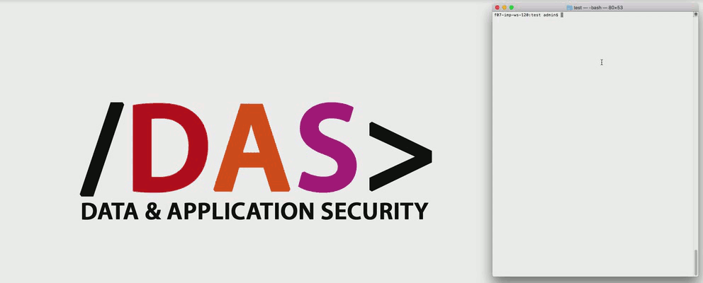

# HOSIT - Humanoid Online Service Inspection Tool

> A Node.js Framework to imitate human internet browsing behavior on Chrome

HOSIT is a Node.js framework which extends the Headless Chrome API
[Puppeteer] with additional functionalities making the automated
internet browsing behavior as humanlike as possible.

We developed this framework for studies on online services which required
our browser automation to be as humanlike as possible. In our work,
[Is This Really You? An Empirical Study on Risk-Based Authentication Applied in
the Wild], we used HOSIT to find out
more about the Risk-based Authentication practices of big online services
(which were kept secret by the companies).

Further details about HOSIT and how you can use it for your own studies are presented in our publication [Even Turing Should Sometimes Not Be Able To Tell: Mimicking Humanoid Usage Behavior for Exploratory Studies of Online Services].

We recorded this video on May 17th, 2019, so the generated search query reflects
a current event covered in German media here (the search query was automatically
generated by HOSIT).

## Table of Contents

<!-- TOC depthFrom:2 depthTo:3 withLinks:1 updateOnSave:1 orderedList:0 -->

- [Table of Contents](#table-of-contents)
- [HOSIT compared to Puppeteer](#hosit-compared-to-puppeteer)
- [Install](#install)
- [Documentation](#documentation)
- [Getting started](#getting-started)
	- [Usage](#usage)
	- ["Headful" mode](#headful-mode)
	- [Settings](#settings)
	- [Add your own search query generator](#add-your-own-search-query-generator)
	- [Database logging](#database-logging)
- [Notice](#notice)
- [Publications](#publications)
	- [HOSIT](#hosit)
	- [Study](#study)
- [License](#license)

<!-- /TOC -->

## HOSIT compared to Puppeteer

Puppeteer 0.13.0                                                                            | HOSIT
--------------------------------------------------------------------------------------------|--------------------------------------------------------------------------------------------------------------------------------------------------------------------------------------------------------------------
Constant typing speed with each key                                                         | **Randomized typing** which varies with each key around a defined deviation
Clicks inside the element's exact center                                                    | Clicks around 1/4 of the element's center with **random deviation**
0 ms delay between pressing and releasing the mouse button                                  | **Randomized delay** between pressing and releasing the mouse button
No scrolling                                                                                | **Scrolling function** with included reading simulation
No search query generation                                                                  | Extendable **Search query generator**
No function to select tabs or frames                                                        | **Selecting tabs/frames** containing a certain URL.
No logging                                                                                  | **Extended logging** functionalities (e.g. taking screenshots, logging all events into a database)
No CAPTCHA solving                                                                          | **Automated solving of (re)CAPTCHAs** (Anti-Captcha API key required)
Commonly used workflows take a lot of code, especially when simulating humanlike identities | **Controller-Class** which simulates behavior of a user identity and eases application of commonly used Puppeteer workflows (e.g. initializing browser, opening/closing tabs, typing/clicking, taking screenshots).

## Install

- With npm:

  ~~~
  npm install hosit-browser
  ~~~

- With yarn:

  ~~~
  yarn install hosit-browser
  ~~~

**Note**: At least Node.js v7.6.0 is needed since this framework relies on the `await`
command. All requirements needed to use Puppeteer also apply for this framework.

## Documentation

The documentation is available at [docs/api.md](docs/api.md)

You can also generate the documentation on your own with [JsDoc]:

~~~
jsdoc -c jsdoc-conf.json
~~~

## Getting started

### Usage

The code has to be entered in an async environment:

~~~js
(async() => {
  // Enter your code here
})();
~~~

1. Import module:

    ~~~js
    // Import module
    const HOSIT = require("hosit-browser")
    ~~~

2. Create an [Identity](docs/api.md#Identity)

    ~~~js
    const testidentity = new HOSIT.Identity("Firstname","Lastname", new Date(1992, 5, 19),
      "email@address.com", "PASSW0RD", "Company", "Position", 456, 265,
      global.GENDER_MALE);
    ~~~

3. Initiate the [Controller](docs/api.md#Controller) and assign it to the created identity.

    ~~~js
    // Initiate controller with test identity
    const controller = await new HOSIT.Controller(testidentity);

    // Start browser session and open new tab
    await controller.init();
    ~~~

4. Now you can control your identity with the contoller object, e.g.:

    ~~~js
    // Open example.com
    await controller.goto("https://example.com");

    // Wait until "More Information"-Link is visible
    await controller.waitForSelector("a[href='http://www.iana.org/domains/example']");

    // Wait a random time period with the standard values
    await controller.randomWait();

    // Click on the "More Information"-Link
    await controller.click("a[href='http://www.iana.org/domains/example']");

    // Wait until the page is loaded
    await controller.waitForNavigation();

    // Wait a random time period with the standard values
    await controller.randomWait();

    // Open new page tab with example.net
    await controller.newPage("http://ixquick.com");

    // Wait around 5 seconds
    await controller.randomWait(5000);

    // Wait until the text field is loaded
    await controller.waitForSelector("input[type='text']");

    // Enter Stuff inside the text field
    await controller.type("input[type='text']", "Here is an example search query: ");
    await controller.typeSearchQuery("input[type='text']");

    // Wait around 5 seconds
    await controller.randomWait(5000);

    // Close the new Page tab
    await controller.closePage();

    // Wait around 5 seconds
    await controller.randomWait(5000);

    // Scroll to the bottom of the last opened page (Simulate reading)
    await controller.scrollToBottom();
    ~~~

The test script is located at [examples/example.js](examples/example.js).

Remember to use `await` in most cases due to the asynchronous functions provided
by the Puppeteer API.

### "Headful" mode

In order to imitate human browsing behavior as humanlike as possible, the browser
is started in the display (GUI) mode. We discovered that the Chromium headless
mode was detected and partially blocked by big online services, which was not
the case with the remote controlled GUI mode.

The GUI mode can be started headlessly on a linux server by starting
it in a "headful" mode with the X virtual framebuffer (Xvfb).

Install (e.g. Ubuntu):

~~~bash
# apt-get install xvfb
~~~

Launch with 1366x768 pixels resolution:

~~~bash
$ xvfb-run --server-args="-screen 0 1366x768x24" ./[path to your NodeJS script].js
~~~

Most of the common known headless Chrome detection methods (at June 2018) can
already be eliminated with the "headful" mode on unmodified versions of
Chrome/Chromium. However, we recommend to [build your own Chromium version] with
additional adjustments (e.g. modify or remove `navigator.webdriver` object) to reduce
detectability even more. See the works by [Antoine Vastel] for more details on
how headless browsers might be detected by services.

### Settings

Settings like browser's user agent string and the window size can be adjusted
by changing the Settings parameters inside the imported HOSIT module.

Following the example above, we could examplary change the user agent to
Firefox 58.0 with:

~~~js
HOSIT.Settings.USER_AGENT = "Mozilla/5.0 (Windows NT 10.0; Win64; x64; rv:58.0) Gecko/20100101 Firefox/58.0";
~~~

Note that some settings have to be set before the `Controller.init` command in
order to be active. All possible settings with its default values can be seen
inside [include/settings.js](include/settings.js).

The Anti-Captcha API key needed for CAPTCHA solving can be added there as well.

### Add your own search query generator

You can enhance the list of search query generators with your own RSS feeds
generators. This might be useful if you want to generate search queries for
different geolocations.

In our example we take the RSS feed for the Google Hot Trends for the US
geolocation:

> https://trends.google.com/trends/hottrends/atom/feed?pn=p1

1. Define properties for the new entry (just like you see in
  [include/settings.js](../include/settings.js)):

    ~~~js
    let trendsus = {
      rssFeedURL: 'https://trends.google.com/trends/hottrends/atom/feed?pn=p1',
      cacheFileName: "trendsusQueries",           // Name of the cache file created in tmp-folder
      queryArrayObject: global.TRENDSUS_QUERIES,  // our Array object where we're saving the queries
      evaluationFunction: function(item) {        // Function which evaluates every feed item and generates the query for it
        // Writes item title in upper case for fun
        return item.title.toUpperCase();
      }
    };
    ~~~

2. Add new entry to the list of search query generators defined in the settings:

    ~~~js
    HOSIT.Settings.SEARCH_QUERY_GENERATORS.hottrends = trendsus;
    ~~~

    If you want to use your query generator as the default generator, just
    change the default object of the list:

    ~~~js
    HOSIT.Settings.SEARCH_QUERY_GENERATORS.default = trendsus;
    ~~~

3. Now we can call our new search query generator with the keyword we used
`hottrends` in our case following the example above:

    ~~~js
    await controller.typeSearchQuery("input[type='text']", "hottrends");
    ~~~

    If you have changed the default generator, you can use the shorter
    function call as well:

    ~~~js
    await controller.typeSearchQuery("input[type='text']");
    ~~~

The test script with the example is located at
[examples/example-new-querygenerator.js](examples/example-new-querygenerator.js)

### Database logging

The Framework can be extended for database logging (MongoDB recommended). See
the project [hosit-logger] for details.

## Notice

This framework was used and tested with Puppeteer 0.13.0 between December
2017 and March 2018. However, we assume that it works with newer Puppeteer
versions as well.

We are convinced that headless detection methods will improve over time (see e.g.
[headless-cat-n-mouse on Github]). After publication of the technical paper,
it is very likely that online services try to protect against HOSIT. So feel free
to improve this framework.

## Publications

### HOSIT

We provide further details about HOSIT in the following publication. There you can also find information on how to use HOSIT for your own research studies. Please cite the paper when using HOSIT in your own studies:

[Even Turing Should Sometimes Not Be Able To Tell: Mimicking Humanoid Usage Behavior for Exploratory Studies of Online Services] (2019) 
_Stephan Wiefling, Nils Gruschka, and Luigi Lo Iacono_. 
_24th Nordic Conference on Secure IT Systems (NordSec 2019)_, Aalborg, Denmark.

#### Bibtex

~~~.bibtex
@inproceedings{article_nordsec2019_wiefling,
	author = {Wiefling, Stephan and Gruschka, Nils and Lo Iacono, Luigi},
	title = {Even {Turing} {Should} {Sometimes} {Not} {Be} {Able} {To} {Tell}: {Mimicking} {Humanoid} {Usage} {Behavior} for {Exploratory} {Studies} of {Online} {Services}},
	booktitle = {24th {Nordic} {Conference} on {Secure} {IT} {Systems} ({NordSec} 2019)},
	series = {{Lecture} {Notes} in {Computer} {Science}},
	volume = {11875},
	isbn = {978-3-030-35055-0},
	doi = {10.1007/978-3-030-35055-0_12},
	publisher = {Springer Nature},
	location = {Aalborg, Denmark},
	month = nov,
	year = {2019}
}
~~~

### Study

We also did a comprehensive study on Risk-based Authentication using this tool:

[Is This Really You? An Empirical Study on Risk-Based Authentication Applied in the Wild] (2019) 
_Stephan Wiefling, Luigi Lo Iacono, and Markus Dürmuth_. 
_34th IFIP TC-11 International Conference on Information Security and Privacy Protection (IFIP SEC 2019)_, Lisbon, Portugal.

#### Bibtex

~~~.bibtex
@inproceedings{Wiefling_Is_2019,
  author = {Wiefling, Stephan and Lo Iacono, Luigi and D\"{u}rmuth, Markus},
  title = {Is {This} {Really} {You}? {An} {Empirical} {Study} on {Risk}-{Based} {Authentication} {Applied} in the {Wild}},
  booktitle = {34th {IFIP} {TC}-11 {International} {Conference} on {Information} {Security} and {Privacy} {Protection} ({IFIP} {SEC} 2019)},
  series = {{IFIP} {Advances} in {Information} and {Communication} {Technology}},
  volume = {562},
  pages = {134--148},
  isbn = {978-3-030-22311-3},
  doi = {10.1007/978-3-030-22312-0_10},
  publisher = {Springer International Publishing},
  location = {Lisbon, Portugal},
  month = jun,
  year = {2019}
}
~~~

## License

This project is licensed under the MIT License ([LICENSE](LICENSE)).

[Even Turing Should Sometimes Not Be Able To Tell: Mimicking Humanoid Usage Behavior for Exploratory Studies of Online Services]: https://nbn-resolving.org/urn:nbn:de:hbz:832-epub4-14221
[Is This Really You? An Empirical Study on Risk-Based Authentication Applied in the Wild]: https://nbn-resolving.org/urn:nbn:de:hbz:832-epub4-13694
[Puppeteer]: https://github.com/GoogleChrome/puppeteer
[Headless Chrome test]: https://intoli.com/blog/not-possible-to-block-chrome-headless/chrome-headless-test.html
[JsDoc]: http://usejsdoc.org/
[Antoine Vastel]: https://github.com/antoinevastel
[hosit-logger]: https://github.com/das-th-koeln/hosit-logger
[build your own Chromium version]: https://github.com/chromium/chromium/blob/master/docs/linux_build_instructions.md
[headless-cat-n-mouse on Github]: https://github.com/paulirish/headless-cat-n-mouse
